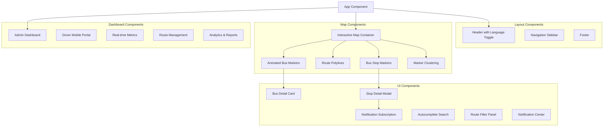

# Design Document

## Overview

The BMTC Transport Tracker is a comprehensive real-time public transport tracking system designed as a modern, accessible, and highly interactive web application. The system follows a microservices-inspired architecture with a React frontend, FastAPI backend, and modular notification system. The design emphasizes smooth animations, bilingual support, and seamless integration with multiple notification gateways.

### Key Design Principles

- **Mobile-first responsive design** with progressive enhancement
- **Real-time data synchronization** using WebSockets and optimistic updates  
- **Modular notification system** with adapter pattern for multiple gateways
- **Accessibility-first approach** with WCAG 2.1 AA compliance
- **Offline-capable** with intelligent caching and sync strategies
- **Animation-rich interface** using Framer Motion for delightful interactions
- **Bilingual support** with i18n architecture for English and Kannada

## Architecture

### System Architecture Diagram

```mermaid
graph TB
    subgraph "Frontend Layer"
        PWA[React PWA App]
        SW[Service Worker]
        Cache[Local Cache/IndexedDB]
    end
    
    subgraph "API Gateway"
        Gateway[FastAPI Gateway]
        Auth[JWT Authentication]
        RateLimit[Rate Limiting]
    end
    
    subgraph "Core Services"
        LocationService[Location Tracking Service]
        NotificationService[Notification Engine]
        UserService[User Management Service]
        AdminService[Admin Dashboard Service]
    end
    
    subgraph "Data Layer"
        Redis[(Redis Cache)]
        MySQL[(MySQL Database)]
        FileStorage[File Storage]
    end
    
    subgraph "Extended Services"
        AnalyticsService[Analytics & Planning Service]
        JourneyPlanner[Multi-Modal Journey Planner]
        DemoService[Demo & Presentation Service]
        USSDService[USSD/IVR Service]
        BeaconService[Bluetooth Beacon Service]
    end
    
    subgraph "External Integrations"
        BMTC[BMTC API / Mock Generator]
        Twilio[Twilio SMS/Voice]
        Exotel[Exotel Gateway]
        WhatsApp[WhatsApp Business API]
        NIC[NIC Government Gateway]
        USSDProvider[USSD Service Provider]
        BeaconNetwork[Bluetooth Beacon Network]
        MetroAPI[Metro/Rail APIs]
        MobilityAPI[Micro-mobility APIs]
    end
    
    PWA --> Gateway
    Gateway --> LocationService
    Gateway --> NotificationService
    Gateway --> UserService
    Gateway --> AdminService
    Gateway --> AnalyticsService
    Gateway --> JourneyPlanner
    Gateway --> DemoService
    Gateway --> USSDService
    Gateway --> BeaconService
    
    LocationService --> Redis
    LocationService --> MySQL
    LocationService --> BMTC
    
    NotificationService --> Twilio
    NotificationService --> Exotel
    NotificationService --> WhatsApp
    NotificationService --> NIC
    
    USSDService --> USSDProvider
    BeaconService --> BeaconNetwork
    JourneyPlanner --> MetroAPI
    JourneyPlanner --> MobilityAPI
    
    AnalyticsService --> MySQL
    UserService --> MySQL
    AdminService --> MySQL
    AdminService --> FileStorage
```



### Technology Stack

**Frontend:**
- React 18 with TypeScript
- Tailwind CSS for styling with custom design tokens
- Framer Motion for animations and transitions
- Leaflet with React-Leaflet for interactive maps
- React Query (TanStack Query) for data fetching and caching
- React Hook Form for form management
- React i18next for internationalization
- Workbox for PWA capabilities
- Bluetooth Web API for beacon integration
- Web Speech API for voice interactions
- Lightweight HTML renderer for low-bandwidth mode

**Backend:**
- FastAPI (Python) for high-performance async API
- WebSocket support for real-time updates
- SQLAlchemy ORM with MySQL database
- Redis for caching and pub/sub messaging
- Celery for background task processing
- Pydantic for data validation and serialization
- USSD gateway integration (Africa's Talking or similar)
- IVR system integration with TTS/ASR capabilities
- Machine learning libraries for predictive analytics
- Geospatial libraries for advanced routing algorithms

**Infrastructure:**
- Docker and Docker Compose for containerization
- Nginx for reverse proxy and static file serving
- Let's Encrypt for SSL certificates (production)
- GitHub Actions for CI/CD pipeline

## Components and Interfaces

### Frontend Component Architecture



### Key Frontend Components

**MapContainer Component:**
- Manages Leaflet map instance with OpenStreetMap tiles
- Handles real-time WebSocket connections for bus location updates
- Implements smooth marker animations using Framer Motion
- Supports clustering for performance at low zoom levels
- Integrates geolocation for nearby stops feature

**BusMarker Component:**
- Animated SVG markers with rotation based on bearing
- Color-coded by route with smooth transitions
- Click handlers for detail card display
- Pulsing animation for selected buses
- Occupancy indicators with visual density representation

**NotificationEngine Component:**
- Manages subscription preferences and delivery channels
- Handles in-app notifications with toast animations
- Integrates with browser push notifications
- Provides notification history and management interface

### Backend API Design

**REST API Endpoints:**

```
GET /api/v1/routes
GET /api/v1/routes/{route_id}/stops
GET /api/v1/stops
GET /api/v1/stops/{stop_id}/arrivals
GET /api/v1/buses
GET /api/v1/buses/{bus_id}/location
POST /api/v1/subscriptions
DELETE /api/v1/subscriptions/{subscription_id}
GET /api/v1/notifications/history

# Admin endpoints
POST /api/v1/admin/routes
PUT /api/v1/admin/routes/{route_id}
DELETE /api/v1/admin/routes/{route_id}
GET /api/v1/admin/dashboard/metrics
GET /api/v1/admin/reports/trips
POST /api/v1/admin/broadcasts

# Driver endpoints  
POST /api/v1/driver/login
POST /api/v1/driver/trips/start
POST /api/v1/driver/trips/end
POST /api/v1/driver/issues
PUT /api/v1/driver/occupancy
```

**WebSocket Endpoints:**
- `/ws/realtime` - Live bus location updates
- `/ws/admin` - Admin dashboard real-time metrics
- `/ws/notifications` - In-app notification delivery

### Notification System Architecture

The notification system uses an adapter pattern to support multiple gateways:

```python
class NotificationAdapter(ABC):
    @abstractmethod
    async def send_sms(self, phone: str, message: str) -> NotificationResult
    
    @abstractmethod  
    async def send_voice(self, phone: str, message: str) -> NotificationResult
    
    @abstractmethod
    async def send_whatsapp(self, phone: str, message: str) -> NotificationResult

class TwilioAdapter(NotificationAdapter):
    # Twilio implementation
    
class ExotelAdapter(NotificationAdapter):
    # Exotel implementation
    
class NICAdapter(NotificationAdapter):
    # NIC government gateway implementation
    
class SimulatedAdapter(NotificationAdapter):
    # Demo mode implementation with local logging
```

## Data Models

### Core Database Schema

```sql
-- Vehicles table
CREATE TABLE vehicles (
    id INT PRIMARY KEY AUTO_INCREMENT,
    vehicle_number VARCHAR(20) UNIQUE NOT NULL,
    capacity INT NOT NULL,
    status ENUM('active', 'maintenance', 'offline') DEFAULT 'active',
    created_at TIMESTAMP DEFAULT CURRENT_TIMESTAMP,
    updated_at TIMESTAMP DEFAULT CURRENT_TIMESTAMP ON UPDATE CURRENT_TIMESTAMP
);

-- Drivers table  
CREATE TABLE drivers (
    id INT PRIMARY KEY AUTO_INCREMENT,
    name VARCHAR(100) NOT NULL,
    phone VARCHAR(15) UNIQUE NOT NULL,
    license_number VARCHAR(50) UNIQUE NOT NULL,
    assigned_vehicle_id INT,
    status ENUM('active', 'inactive', 'on_break') DEFAULT 'active',
    created_at TIMESTAMP DEFAULT CURRENT_TIMESTAMP,
    FOREIGN KEY (assigned_vehicle_id) REFERENCES vehicles(id)
);

-- Routes table
CREATE TABLE routes (
    id INT PRIMARY KEY AUTO_INCREMENT,
    name VARCHAR(100) NOT NULL,
    route_number VARCHAR(20) UNIQUE NOT NULL,
    geojson TEXT NOT NULL,
    polyline TEXT NOT NULL,
    is_active BOOLEAN DEFAULT TRUE,
    created_at TIMESTAMP DEFAULT CURRENT_TIMESTAMP
);

-- Stops table
CREATE TABLE stops (
    id INT PRIMARY KEY AUTO_INCREMENT,
    route_id INT NOT NULL,
    name VARCHAR(100) NOT NULL,
    name_kannada VARCHAR(100),
    latitude DECIMAL(10, 8) NOT NULL,
    longitude DECIMAL(11, 8) NOT NULL,
    stop_order INT NOT NULL,
    created_at TIMESTAMP DEFAULT CURRENT_TIMESTAMP,
    FOREIGN KEY (route_id) REFERENCES routes(id),
    INDEX idx_location (latitude, longitude)
);

-- Trips table
CREATE TABLE trips (
    id INT PRIMARY KEY AUTO_INCREMENT,
    vehicle_id INT NOT NULL,
    route_id INT NOT NULL,
    driver_id INT NOT NULL,
    start_time TIMESTAMP NULL,
    end_time TIMESTAMP NULL,
    status ENUM('scheduled', 'active', 'completed', 'cancelled') DEFAULT 'scheduled',
    created_at TIMESTAMP DEFAULT CURRENT_TIMESTAMP,
    FOREIGN KEY (vehicle_id) REFERENCES vehicles(id),
    FOREIGN KEY (route_id) REFERENCES routes(id),
    FOREIGN KEY (driver_id) REFERENCES drivers(id)
);

-- Vehicle locations table (for real-time tracking)
CREATE TABLE vehicle_locations (
    id INT PRIMARY KEY AUTO_INCREMENT,
    vehicle_id INT NOT NULL,
    latitude DECIMAL(10, 8) NOT NULL,
    longitude DECIMAL(11, 8) NOT NULL,
    speed DECIMAL(5, 2) DEFAULT 0,
    bearing INT DEFAULT 0,
    recorded_at TIMESTAMP DEFAULT CURRENT_TIMESTAMP,
    FOREIGN KEY (vehicle_id) REFERENCES vehicles(id),
    INDEX idx_vehicle_time (vehicle_id, recorded_at),
    INDEX idx_location (latitude, longitude)
);

-- Subscriptions table
CREATE TABLE subscriptions (
    id INT PRIMARY KEY AUTO_INCREMENT,
    phone VARCHAR(15) NOT NULL,
    stop_id INT NOT NULL,
    channel ENUM('sms', 'voice', 'whatsapp', 'push') NOT NULL,
    eta_threshold INT DEFAULT 5,
    is_active BOOLEAN DEFAULT TRUE,
    created_at TIMESTAMP DEFAULT CURRENT_TIMESTAMP,
    FOREIGN KEY (stop_id) REFERENCES stops(id),
    INDEX idx_phone (phone),
    INDEX idx_stop (stop_id)
);

-- Notifications log table
CREATE TABLE notifications (
    id INT PRIMARY KEY AUTO_INCREMENT,
    subscription_id INT NOT NULL,
    message TEXT NOT NULL,
    channel VARCHAR(20) NOT NULL,
    status ENUM('pending', 'sent', 'failed', 'delivered') DEFAULT 'pending',
    sent_at TIMESTAMP NULL,
    delivered_at TIMESTAMP NULL,
    error_message TEXT NULL,
    created_at TIMESTAMP DEFAULT CURRENT_TIMESTAMP,
    FOREIGN KEY (subscription_id) REFERENCES subscriptions(id)
);
```

### Redis Data Structures

```
# Real-time bus locations (expires in 5 minutes)
bus:location:{vehicle_id} -> {lat, lng, speed, bearing, timestamp}

# Route cache (expires in 1 hour)  
route:{route_id} -> {route_data_json}

# Stop cache (expires in 1 hour)
stop:{stop_id} -> {stop_data_json}

# ETA calculations cache (expires in 2 minutes)
eta:{vehicle_id}:{stop_id} -> {eta_seconds, confidence}

# Active subscriptions by stop (for quick lookup)
subscriptions:stop:{stop_id} -> Set[subscription_id]

# WebSocket connections by channel
ws:realtime -> Set[connection_id]
ws:admin -> Set[connection_id]
```

## Error Handling

### Frontend Error Handling Strategy

**Network Errors:**
- Implement exponential backoff for failed API requests
- Show user-friendly error messages with retry options
- Gracefully degrade to cached data when possible
- Display connection status indicator in header

**Map Errors:**
- Fallback to cached tile layers when map tiles fail to load
- Show placeholder markers when bus location data is unavailable
- Handle geolocation permission denied gracefully
- Provide manual location input as fallback

**Notification Errors:**
- Queue failed notifications for retry
- Show delivery status in notification history
- Provide alternative notification channels when primary fails
- Log errors for admin review and debugging

### Backend Error Handling

**Database Errors:**
- Implement connection pooling with automatic reconnection
- Use database transactions for data consistency
- Provide meaningful error messages without exposing internal details
- Log all database errors for monitoring and debugging

**External API Errors:**
- Implement circuit breaker pattern for external service calls
- Fallback to mock data when BMTC API is unavailable
- Retry failed notification deliveries with exponential backoff
- Monitor external service health and adjust behavior accordingly

**WebSocket Errors:**
- Automatic reconnection with exponential backoff
- Graceful handling of connection drops
- Message queuing for offline clients
- Connection health monitoring and cleanup

## Testing Strategy

### Frontend Testing

**Unit Tests:**
- Component rendering and prop handling
- Utility functions for ETA calculations
- Form validation logic
- Animation trigger conditions
- i18n translation loading

**Integration Tests:**
- Map component with real location data
- WebSocket connection handling
- API integration with mock responses
- Notification subscription flow
- Search and filter functionality

**E2E Tests:**
- Complete user journey from search to subscription
- Admin dashboard functionality
- Driver portal trip management
- Cross-browser compatibility
- Mobile responsiveness

### Backend Testing

**Unit Tests:**
- API endpoint request/response handling
- Database model operations
- Notification adapter implementations
- ETA calculation algorithms
- Authentication and authorization

**Integration Tests:**
- Database operations with test data
- WebSocket message broadcasting
- External API integration (mocked)
- Background task processing
- Cache operations with Redis

**Load Tests:**
- WebSocket connection limits
- API endpoint performance under load
- Database query optimization
- Notification delivery throughput
- Real-time update scalability

### Mock Data Strategy

**BMTC Mock Generator:**
- Realistic bus routes based on actual BMTC network
- Simulated GPS coordinates with natural movement patterns
- Variable speed and delay scenarios
- Rush hour traffic simulation
- Breakdown and maintenance scenarios

**Test Accounts:**
- Admin user: admin@bmtc.gov.in / admin123
- Driver users: driver1@bmtc.gov.in / driver123, driver2@bmtc.gov.in / driver123  
- Test phone numbers: +91-9876543210, +91-9876543211
- Demo subscription scenarios with different notification preferences

This design provides a solid foundation for building a production-ready, scalable, and user-friendly public transport tracking system that meets all the specified requirements while maintaining high performance and accessibility standards.